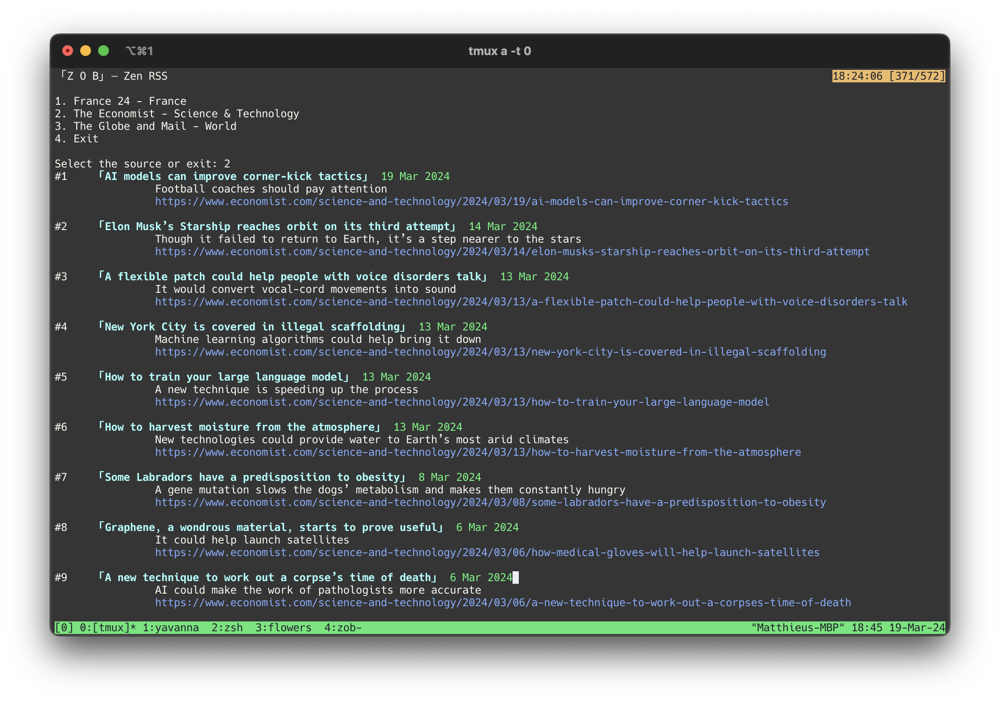

# zob
The **「Zen Org Binder」** My life in plain text
<p align="center">
  
</p>

Inspired by the [suckless philosophy](https://suckless.org/philosophy/) all programs
in the `ZOB` ecosystem:
- Adhere to the UNIX philosophy and do one thing
- Are written in <1000 lines of frugal C99

# goal
The `ZOB` binary aims to:
- Be my trusty steed across UNIX systems
- Have a small memory footprint
- Link against the fewest possible libraries:
  - [libcurl](https://curl.se/libcurl/)'s C API is being used as raw sockets don't support tls

The `ZOB` binary does not have a runtime config, and is (re)built with its settings as the
`ZOBMASTER` sees fit. It uses an in-process [SQLite](https://www.sqlite.org/index.html) 
database which persists to `<ZOB_DB_NAME>.db` at the root of the `ZOB_DIRECTORY`. 
The `ZOBMASTER` pseudonym is used as the `<author>` for zob typsetting programs.

<p align="center">
  
</p>

# programs
```
zob todo        — todo manager
zob rss         — simple RSS feed reader
zob fmt         — wrapper for all your code linters
zob tex         — (.md -> LaTeX) generator
zob html        — (.md -> HTML) generator
zob mem         — ???
```

# zob rss
<p align="center">
  
</p>
